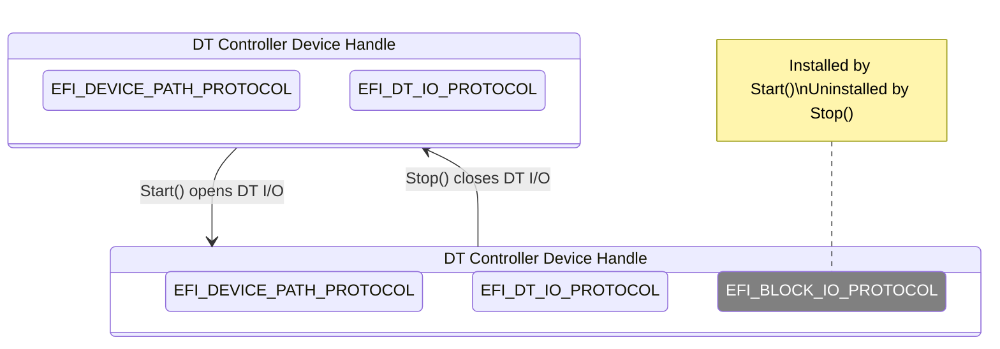

# Devicetree Device Drivers

> [!NOTE]
> See [FdtBusPkg Documentation Style and Terms Definitions](StyleAndTerms.md) first.

DT (Devicetree) device drivers manage DT controllers.  Device handles
for supported DT controllers are created by a Devicetree bus driver
(e.g. FdtBusDxe).

There are two approaches to writing such drivers. The preferred
mechanism is to follow the UEFI Driver Model by implementing
driver binding. The alternative approach (called legacy in this
document) may be suitable under some circumstances.

See [HighMemDxe](../Drivers/HighMemDxe) for an example of a driver
that can be compiled as either a UEFI Driver Model driver or a legacy driver.

## UEFI Driver Model

A DT device driver following the UEFI Driver Model does so by
installing an `EFI_DRIVER_BINDING_PROTOCOL` on the the driver image
handle. The UEFI driver dispatch logic will then use installed
protocol to match device drivers against available device handles.

A DT device driver typically does not create any new
device handles. Instead, it attaches a protocol instance to the device
handle of the DT controller. These protocol instances are I/O
abstractions that allow the DT controller to be used in the preboot
environment. The most common I/O abstractions are used to boot an EFI
compliant OS.

The following figure shows the device handle for a DT controller
before and after `Start()` Driver Binding Protocol function is
called. In this example, a DT device driver is adding the Block I/O
Protocol to the device handle for the DT controller.


### Driver Binding Protocol for DT Device Drivers

The Driver Binding Protocol contains three services. These are
`Supported()`, `Start()`, and `Stop()`.

#### `Supported()`

`Supported()` tests to see if the DT
device driver can manage a device handle. A DT device driver can only
manage device handles that contain the Device Path Protocol and the
Devicetree I/O Protocol, so a DT device driver must look for these two
protocols on the device handle that is being tested. In addition, it
needs to check to see if the device handle represents a DT controller
that the DT device driver knows how to manage. This is typically done
by using the services of the Devicetree I/O Protocol to check the
device against supported _compatible_ (identification) and other
expected property values.

#### `Start()`

The `Start()` function tells the DT device driver to start managing a
DT controller. A DT device driver typically does not create any new
device handles. Instead, it installs one or more additional protocol
instances on the device handle for the DT controller.

#### `Stop()`

The `Stop()` function mirrors the `Start()` function, so the `Stop()`
function completes any outstanding transactions to the DT controller
and removes the protocol interfaces that were installed in
`Start()`.

### DT Controllers with Children

Some DT device drivers may need to create new device handles.

[VirtioFdtDxe](../Drivers/VirtioFdtDxe) is a good example of a DT
controller device driver creating a new device handle that is NOT
a DT controller.

In some situations, a DT controller's children are actually DT
controllers that need to be enumerated.  A good example may be
supporting a Devicetree node for a composite device
such as a NIC or graphics.

Let's examine a Devicetree snippet:

```
genet: ethernet@7d580000 {
       compatible = "brcm,bcm2711-genet-v5";
       ...

       genet_mdio: mdio@e14 {
                   compatible = "brcm,genet-mdio-v5";
                   ...

                   phy1: ethernet-phy@1 {
                         compatible = "phy-driver-compat-string";
                         reg = <0x1>;
                   }
       };
};
```

In this example, the NIC driver would bind to the `genet` device and
enumerate the MDIO device (which would probably bind to the same
NIC driver). In the context of the MDIO device, it would then
enumerate the `phy1` device, and continue initialization
once a PHY driver loads and publishes an interface.

Such drivers have additional `EFI_DT_IO_PROTOCOL`-specific
operations they need to perform in their `Start()` and `Stop()` Driver
Binding Protocol functions.

> [!NOTE]
> You might wonder why these child DT controllers cannot all be
> automatically enumerated by FdtBusDxe. That would imply
> FdtBusDxe would be managing every DT controller, which would
> prevent any other driver from starting on the created DT handles!
> FdtBusDxe binds to a very small set of DT controller types.

#### `Start()`

DT device drivers that need to enumerate further child DT controllers
can do so via the `ScanChildren()` Devicetree I/O Protocol function. A
driver has the option of creating all of its children in one call to
`Start()`, or spreading it across several calls to `Start()`. In
general, if it is possible to design a driver to create one child at a
time (e.g. the child is not some intrinsic criticial component of the
device), it should do so to support the rapid boot capability in the
UEFI Driver  Model. DT device drivers enumerating child DT controllers
may also register callback via the `SetCallbacks()` Devicetree I/O
Protocol function, to directly handle child register reads and writes.

#### `Stop()`

If the DT device driver enumerated further child DT
controllers, these need to be cleaned up via the `RemoveChild()`
Devicetree I/O Protocol function. If DT bus driver callbacks were
registered, these must be unregistered via an appropriate `SetCallbacks()`
Devicetree I/O Protocol function call.

## Legacy Drivers

Legacy drivers are generally outside the realm of bus-enumerated
device handles. These typically directly publish a protocol and
hardcode the device details. However, there may be objective reasons
why a driver makes use of a device handle with an `EFI_DT_IO_PROTOCOL`
but bypasses driver binding.

Tiano has a notion of "library drivers". For example, there's a
generic Serial DXE driver, where the actual hardware interaction is
encapsulated entirely by SerialPortLib, where the SerialPortLib
interface is generic enough for a library to be linked to SEC, PEI, DXE
or even MM images. Similarly, PciHostBridgeDxe relies on
PciHostBridgeLib for discovery of PCIe RC information. These
drivers do not publish an `EFI_DRIVER_BINDING_PROTOCOL`. In
an environment with DT controllers, they rely on libraries to
fully encapsulate any discovery and interaction with
`EFI_DT_IO_PROTOCOL`-bearing device handles.

A legacy driver or library can use the following steps to locate
supported DT controllers:

- Call the `LocateHandleBuffer` UEFI Boot Service with the
  `gEfiDtIoProtocolGuid`.
- For every handle:
  - Call `OpenProtocol()` Boot Service with `BY_DRIVER` to get
    the DT I/O Protocol.
  - Use the `IsCompatible()` Devicetree I/O Protocol call to identify supported controllers.
  - Call `CloseProtocol()` Boot Service on unsupported controllers.

> [!TIP]
> Using `OpenProtocol()` instead of `HandleProtocol()` ensures
> the driver doesn't accidentally bind to handles that are
> already managed. It also ensures that other (well behaved)
> drivers won't use the handle.

> [!CAUTION]
> Failing to close unsupported controllers will result in other
> drivers not being able to start on their device handles!

See [PciHostBridgeLibEcam](../Library/PciHostBridgeLibEcam) for a
"library driver" example.

It's easy to identify DT controllers that are managed by a legacy
driver. These are listed as `Legacy-Managed Device`:

```
Shell> devtree
...
 Ctrl[2A] DT(DtRoot)
   Ctrl[2C] DT(reserved-memory)
   Ctrl[2D] DT(fw-cfg@10100000)
   Ctrl[2E] DT(flash@20000000)
   Ctrl[2F] DT(chosen)
   Ctrl[30] DT(poweroff)
   Ctrl[31] DT(reboot)
   Ctrl[32] DT(platform-bus@4000000)
   Ctrl[33] Legacy-Managed Device
   Ctrl[34] DT(cpus)
...
```
