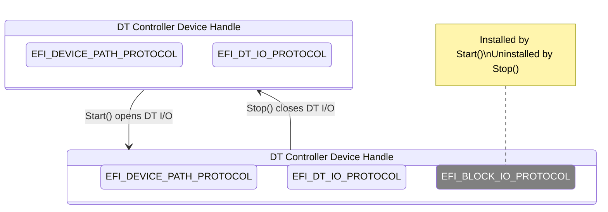

# Devicetree Device Drivers

> [!NOTE]
> See [FdtBusPkg Documentation Style and Terms Definitions](StyleAndTerms.md) first.

DT (Devicetree) device drivers manage DT controllers.  Device handles
for supported DT controllers are created by a Devicetree bus driver
(e.g. FdtBusDxe).

A DT device driver typically does not create any new
device handles. Instead, it attaches protocol instance to the device
handle of the DT controller. These protocol instances are I/O
abstractions that allow the DT controller to be used in the preboot
environment. The most common I/O abstractions are used to boot an EFI
compliant OS.

Some DT device drivers may need to create new device handles. A good
example may be supporting a Devicetree node for a composite device
such as a NIC or graphics. For example, a NIC Devicetree node may
include child Devicetree nodes for a PHY, MAC, etc.

## Driver Binding Protocol for DT Device Drivers

The Driver Binding Protocol contains three services. These are
`Supported()`, `Start()`, and `Stop()`.

`Supported()` tests to see if the DT
device driver can manage a device handle. A DT device driver can only
manage device handles that contain the Device Path Protocol and the
Devicetree I/O Protocol, so a DT device driver must look for these two
protocols on the device handle that is being tested. In addition, it
needs to check to see if the device handle represents a DT controller
that the DT device driver knows how to manage. This is typically done
by using the services of the Devicetree I/O Protocol to check the
device against supported _compatible_ (identification) and other
expected property values.

The `Start()` function tells the DT device driver to start managing a
DT controller. A DT device driver typically does not create any new
device handles. Instead, it installs one or more additional protocol
instances on the device handle for the DT controller. DT device
drivers that need to enumerate further child DT controllers can do so
via the `ScanChildren()` Devicetree I/O Protocol function. A driver
has the option of creating all of its children in one call to `Start()`,
or spreading it across several calls to `Start()`. In general, if it is
possible to design a driver to create one child at a time (e.g. the
child is not some intrinsic criticial component of the device), it
should do so to support the rapid boot capability in the UEFI Driver
Model. DT device drivers enumerating child DT controllers may also
register callback via the `SetCallbacks()` Devicetree I/O Protocol function,
to directly handle child register reads and writes.

The `Stop()` function mirrors the `Start()` function, so the `Stop()`
function completes any outstanding transactions to the DT controller
and removes the protocol interfaces that were installed in
`Start()`. If the DT device driver enumerated further child DT
controllers, these need to be cleaned up via the `RemoveChild()`
Devicetree I/O Protocol function. If DT bus driver callbacks were
registered, these must be unregistered via an appropriate `SetCallbacks()`
Devicetree I/O Protocol function call.

The following figure shows the device handle for a DT Controller
before and after `Start()` is called. In this example, a DT device
driver is adding the Block I/O Protocol to the device handle for the
DT Controller.

