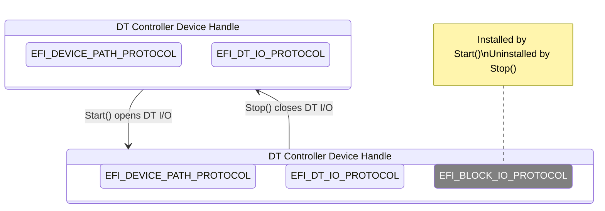
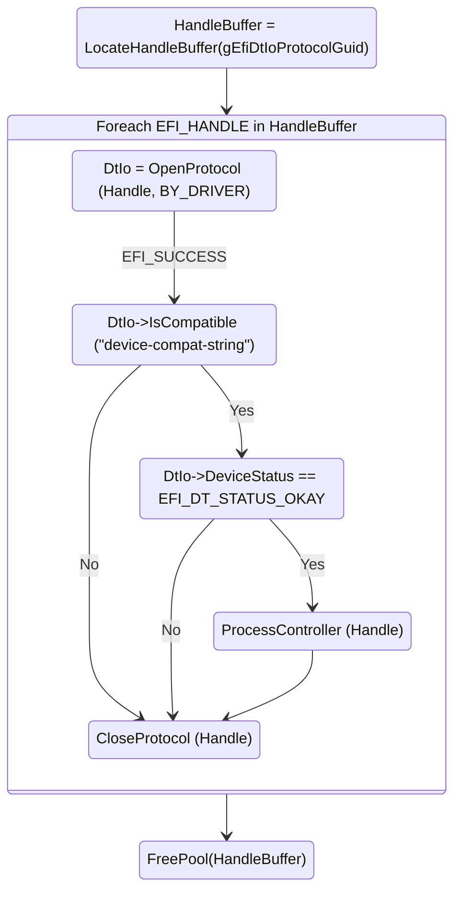
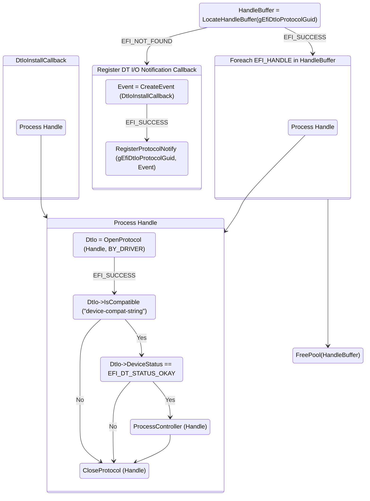

# Devicetree Device Drivers

> [!NOTE]
> See [FdtBusPkg Documentation Style and Terms Definitions](StyleAndTerms.md) first.

DT (Devicetree) device drivers manage DT controllers.  Device handles
for supported DT controllers are created by a Devicetree bus driver
(e.g. FdtBusDxe).

There are two approaches to writing such drivers. The preferred
mechanism is to follow the UEFI Driver Model by implementing
driver binding. The alternative approach (called legacy in this
document) may be suitable under some circumstances.

See [SampleDeviceDxe](../Drivers/SampleDeviceDxe) for a basic template
of a UEFI Driver Model driver.

See [HighMemDxe](../Drivers/HighMemDxe) for an example of a driver
that can be compiled as either a UEFI Driver Model driver or a legacy driver.

## UEFI Driver Model

A DT device driver following the UEFI Driver Model does so by
installing an `EFI_DRIVER_BINDING_PROTOCOL` on the the driver image
handle. The UEFI driver dispatch logic will then use installed
protocol to match device drivers against available device handles.

A DT device driver typically does not create any new
device handles. Instead, it attaches a protocol instance to the device
handle of the DT controller. These protocol instances are I/O
abstractions that allow the DT controller to be used in the preboot
environment. The most common I/O abstractions are used to boot an EFI
compliant OS.

The following figure shows the device handle for a DT controller
before and after `Start()` Driver Binding Protocol function is
called. In this example, a DT device driver is adding the Block I/O
Protocol to the device handle for the DT controller.


### Driver Binding Protocol for DT Device Drivers

The Driver Binding Protocol contains three services. These are
`Supported()`, `Start()`, and `Stop()`.

#### `Supported()`

`Supported()` tests to see if the DT
device driver can manage a device handle. A DT device driver can only
manage device handles that contain the Device Path Protocol and the
Devicetree I/O Protocol, so a DT device driver must look for these two
protocols on the device handle that is being tested.

In addition, the `Supported()` function needs to check if the DT controller
can be managed. This is typically done by using Devicetree I/O Protocol
functions to check against supported _compatible_ (identification) and
other expected property values (such as device status):

```
BOOLEAN Supported;

Supported = !EFI_ERROR (DtIo->IsCompatible (DtIo, "device-compat-string")) &&
            DtIo->DeviceStatus == EFI_DT_STATUS_OKAY;
```

#### `Start()`

The `Start()` function tells the DT device driver to start managing a
DT controller. First, the `Start()` function needs to use the `OpenProtocol()`
Boot Service with `BY_DRIVER` to open the relevant protocols, like the DT
 I/O Protocol.

A DT device driver typically does not create any new
device handles. Instead, it installs one or more additional protocol
instances on the device handle for the DT controller.

#### `Stop()`

The `Stop()` function mirrors the `Start()` function, so the `Stop()`
function completes any outstanding transactions to the DT controller
and removes the protocol interfaces that were installed in
`Start()`.

### DT Controllers with Children

Some DT device drivers may need to create new device handles.
Such a driver acts like a bus driver.

[VirtioFdtDxe](../Drivers/VirtioFdtDxe) is a good example of a DT
controller device driver creating a new device handle that is NOT
a DT controller.

In some situations, a DT controller's children are actually DT
controllers that need to be enumerated.  A good example may be
supporting a Devicetree node for a composite device
such as a NIC or graphics.

Let's examine a Devicetree snippet:

```
genet: ethernet@7d580000 {
       compatible = "brcm,bcm2711-genet-v5";
       ...

       genet_mdio: mdio@e14 {
                   compatible = "brcm,genet-mdio-v5";
                   ...

                   phy1: ethernet-phy@1 {
                         compatible = "phy-driver-compat-string";
                         reg = <0x1>;
                   }
       };
};
```

In this example, the NIC driver would bind to the `genet` device and
enumerate the MDIO device (which would probably bind to the same
NIC driver). In the context of the MDIO device, it would then
enumerate the `phy1` device, and continue initialization
once a PHY driver loads and publishes an interface.

> [!TIP]
> How could a driver managing a DT controller and its children
> be able to relate a DT controller `EFI_HANDLE` to another
> another device being managed? You can use the `ParentDevice`
> structure field in `EFI_DT_IO_PROTOCOL`.

Such drivers have additional `EFI_DT_IO_PROTOCOL`-specific
operations they need to perform in their `Start()` and `Stop()` Driver
Binding Protocol functions.

> [!NOTE]
> You might wonder why these child DT controllers cannot all be
> automatically enumerated by FdtBusDxe. That would imply
> FdtBusDxe would be managing every DT controller, which would
> prevent any other driver from starting on the created DT handles!
> FdtBusDxe binds to a very small set of DT controller types.

#### `Supported()`

The `Supported()` call may need to check if the child controller
specified by  `RemainingDevicePath` is supported.

> [!WARNING]
> Keep it mind that `OpenProtocol()` Boot Service may return
> `EFI_ALREADY_STARTED`, which should be handled like `EFI_SUCCESS`.

#### `Start()`

DT device drivers that need to enumerate further child DT controllers
can do so via the `ScanChildren()` Devicetree I/O Protocol function. A
driver has the option of creating all of its children in one call to
`Start()`, or spreading it across several calls to `Start()`. In
general, if it is possible to design a driver to create one child at a
time (e.g. the child is not some intrinsic criticial component of the
device), it should do so to support the rapid boot capability in the
UEFI Driver  Model. DT device drivers enumerating child DT controllers
may also register callback via the `SetCallbacks()` Devicetree I/O
Protocol function, to directly handle child register reads and writes.

> [!WARNING]
> Keep it mind that `OpenProtocol()` may return `EFI_ALREADY_STARTED`,
> which should be handled like `EFI_SUCCESS` with some caveats.
> See [VirtioFdtDxe](../Drivers/VirtioFdtDxe/DriverBinding.c#L416) for a simple example.

#### `Stop()`

If the DT device driver enumerated further child DT
controllers, these need to be cleaned up via the `RemoveChild()`
Devicetree I/O Protocol function. If DT bus driver callbacks were
registered, these must be unregistered via an appropriate `SetCallbacks()`
Devicetree I/O Protocol function call.

## Legacy Drivers

Legacy drivers are generally outside the realm of bus-enumerated
device handles. These typically directly publish a protocol and
hardcode the device details. However, there may be objective reasons
why a driver makes use of a device handle with an `EFI_DT_IO_PROTOCOL`
but bypasses driver binding.

Tiano has a notion of "library drivers". For example, there's a
generic Serial DXE driver, where the actual hardware interaction is
encapsulated entirely by SerialPortLib, where the SerialPortLib
interface is generic enough for a library to be linked to SEC, PEI, DXE
or even MM images. Similarly, PciHostBridgeDxe relies on
PciHostBridgeLib for discovery of PCIe RC information. These
drivers do not publish an `EFI_DRIVER_BINDING_PROTOCOL`. In
an environment with DT controllers, they rely on libraries to
fully encapsulate any discovery and interaction with
`EFI_DT_IO_PROTOCOL`-bearing device handles.

> [!TIP]
> You may wonder if using DT I/O Protocol is warranted for a legacy driver,
> compared to older approaches like FdtClientDxe or even manual Devicetree parsing.
> Using DT I/O Protocol is always better and results in simpler, more correct
> and more portable code. For example, the DT I/O layer handles proper
> property parsing, translation of _reg_ and _ranges_ addresses, DMA and I/O
> mechanics, etc. [PciHostBridgeLibEcam](../Library/PciHostBridgeLibEcam) and
> [HighMemDxe](../Drivers/HighMemDxe) are great examples of code being
> improved by moving to the DT I/O Protocol (compare to OvmfPkg/Fdt/HighMemDxe and
> OvmfPkg/Library/PciHostBridgeUtilityLib).

### Simple Example

The following figure demonstrates how a legacy driver or library can locate
supported DT controllers.


The steps are:

- Call the `LocateHandleBuffer` UEFI Boot Service with the
  `gEfiDtIoProtocolGuid`.
- For every handle:
  - Locate the DT I/O Protocol on the handle.
    - If the controller is meant to be exclusively used by the driver or library
      (e.g. talking to hardware),  call `OpenProtocol()` Boot Service with `BY_DRIVER`
      to get the DT I/O Protocol. This ensures the driver doesn't start using a
      controller that is already managed by another driver. It also ensures that
      other (well behaved) drivers won't use the controller until it is released.
    - If the resource is meant to be shared with other components (e.g. SerialPortLib),
      or if the driver or library simply wants to query some information about the controller
      (i.e. not talk to hardware), use `HandleProtocol()`.
  - Use the `IsCompatible()` Devicetree I/O Protocol call to identify supported controllers.
  - Filter out controllers with `DtIo->DeviceStatus != EFI_DT_STATUS_OKAY`.
  - Call `CloseProtocol()` Boot Service on unsupported controllers if `OpenProtocol()` was used.
- Free handle buffer.

> [!CAUTION]
> Failing to close unsupported controllers will result in other
> drivers not being able to start on their device handles!

See [PciHostBridgeLibEcam](../Library/PciHostBridgeLibEcam) for an example.

This library has a dependency on `gEfiDtIoProtocolGuid`,
as the supported controllers are expected to be enumerated once
FdtBusDxe loads, so the availability of a DT controller present in the system is sufficient.

PciHostBridgeLibEcam only has a single user - PciHostBridgeLibEcam,
so the DT I/O protocol is located using `OpenProtocol` with `BY_DRIVER`.

It's easy to identify DT controllers that are managed by a legacy
driver that uses `OpenProtocol()` as suggested. These are listed as `Legacy-Managed Device`:

```
Shell> devtree
...
 Ctrl[2A] DT(DtRoot)
   Ctrl[2C] DT(reserved-memory)
   Ctrl[2D] DT(fw-cfg@10100000)
   Ctrl[2E] DT(flash@20000000)
   Ctrl[2F] DT(chosen)
   Ctrl[30] DT(poweroff)
   Ctrl[31] DT(reboot)
   Ctrl[32] DT(platform-bus@4000000)
   Ctrl[33] Legacy-Managed Device
   Ctrl[34] DT(cpus)
...
```

### Another Simple Approach

Instead of enumerating existing handles, a legacy driver could
directly look up a device, if the path to the device is known.

```
  DtIo = FbpGetDtRoot ();
  ASSERT (DtIo != NULL);

  Status = DtIo->Lookup (DtIo, "/soc/serial@10000000", TRUE, &Handle);
  ASSERT_EFI_ERROR (Status);

  Status = gBS->HandleProtocol (
                  Handle,
                  &gEfiDtIoProtocol,
                  (VOID **)&DtIo
                  );
  ASSERT_EFI_ERROR (Status);

  //
  // Perform OpenProtocol (Handle, BY_DRIVER) and other steps
  // as before.
  //
```

The example first looks up the `EFI_DT_IO_PROTOCOL` for the root DT
controller using the `FbpGetDtRoot ()` function provided by the
convenience FbpUtilsLib library. The code then does a lookup by
an absolute path or alias of a UART device, connecting any missing
DT controllers along the way (provided they have UEFI Driver Model
drivers!).

This approach is more straighforward and can deal with the looked-up
device not being enumerated at the time of invocation, but requires
knowing the full path or alias to the device, which is highly
hardware and platform specific.

### More Complex Example

The following figure demonstrates supporting controllers enumerated after the legacy driver loads. Some controllers are handled immediately, while
other ones are picked up in the future as they are enumerated.



The steps are:
- Register a protocol notification callback on `gEfiDtIoProtocolGuid`.
- Identify the DT controller handles inside the notification callback via `LocateHandle` Boot Service using `ByRegisterNotify`.
- Locate the DT I/O Protocol as appropriate.
- Close the notification callback event if no more DT controllers are expected.

See [FdtPciPcdProducerLib](../Library/FdtPciPcdProducerLib) for an example.

This library is linked into a number of drivers,
including CpuDxe. The latter is a dependency for FdtBusDxe (as it
publishes `EFI_CPU_IO2_PROTOCOL`), so it is not possible to use a
`[Depex]` dependency on `gEfiDtIoProtocolGuid`. Instead, if
`LocateHandleBuffer` fails because the library is used before
FdtBusDxe is loads, a protocol notification callback
is set.

Because this library is linked into a number of drivers, and because
its interaction with the DT controller is limited to querying a few
properties about it, the DT I/O Protocol is located using `HandleProtocol`
and not `OpenProtocol`.

> [!CAUTION]
> If allocating resources in a library, don't forget to clean these
> up in a destructor function. Failure to close events in a library
> will cause crashes when a callback is invoked in an unloaded driver!

Yes, legacy drivers are awkward and messy. This is why the UEFI Driver Model exists!

## Adapting Existing Drivers to `EFI_DT_IO_PROTOCOL`

Aside from figuring out device discovery (legacy vs. UEFI Driver Model) the
next big question to solve is how to interact with a device. The `GetReg()`
DT I/O Protocol function is similar to fetching the BAR info for a PCI
device. `GetReg()` will populate an `EFI_DT_REG` descriptor.

For some drivers, it will be easy enough to simply use appropriate DT
I/O Protocol functions (`ReadReg()` and friends), which operate
directly on the `EFI_DT_REG` descriptor.
[PciSioSerialDxe](../Drivers/PciSioSerialDxe/SerialIo.c#L1371) is a
good example.

Other drivers may be a bit more involved. Maybe you need the actual
CPU address. Maybe you'll need the untranslated bus address. Maybe
you'll need the length of the register
region. [VirtioFdtDxe](../Drivers/VirtioFdtDxe/DriverBinding.c#L441) is a
good example: it actually creates a child device for the managed DT
controller, to which a generic (Virtio10) driver binds. This generic
driver doesn't know anything about FDT or PCI controllers, so the
`VIRTIO_MMIO_DEVICE` needs the actual CPU address of the device. The
`TranslatedBase` field of a register descriptor is a CPU address
if the `BusDtIo` field is NULL, meaning that FdtBusDxe was able
to translate the bus address to a CPU address. If the field is not
NULL, then `TranslatedBase` is a bus address that is valid in the
context of the ancestor DT controller referenced by `BusDtIo`, and you
can only perform I/O using the DT I/O Protocol functions (`ReadReg()` and
friends, and [only if the ancestor device driver implements the I/O
callbacks](../Drivers/FdtBusDxe/DtIo.c#L438)).

See notes on [register access API](DtIoProtocol.md#register-access).

## Critical Device Drivers

Typically, a UEFI environment only initializes the devices required to
boot an OS. Here we are, of course, only talking about device drives
that comply to the UEFI Driver Model. UEFI firmware usually
initializes every possible device (e.g. connects drivers to
controllers)  only in situations, when there is no known OS to boot
(e.g. when there is a need to enumerate every possible boot device, or
when entering a setup utility).

What about the devices that are not in the boot path?

### Manually Connecting during the BDS Phase

A good example here are console devices - the actual devices required
to connect are usually well known ahead of time. A Tiano
implementation using MdeModulePkg/Universal/BdsDxe typically sets
these up in the PlatformBootManagerLib component.

Here is an example of a `PlatformBootManagerBeforeConsole ()` excerpt,
that sets up a serial console (backed by
[PciSioSerialDxe](../Drivers/PciSioSerialDxe)).

```
  //
  // Add the hardcoded serial console device path to ConIn, ConOut, ErrOut.
  //
  CopyGuid (&mSerialConsoleSuffix.TermType.Guid, &gEfiTtyTermGuid);

  DtIo = FbpGetDtRoot ();
  ASSERT (DtIo != NULL);

  Status = DtIo->Lookup (DtIo, "/soc/serial@10000000", TRUE, &Handle);
  ASSERT_EFI_ERROR (Status);

  Status = gBS->HandleProtocol (
                  Handle,
                  &gEfiDevicePathProtocolGuid,
                  (VOID **)&DtDp
                  );
  ASSERT_EFI_ERROR (Status);

  NewDp = AppendDevicePath (DtDp, (VOID *)&mSerialConsoleSuffix);

  EfiBootManagerUpdateConsoleVariable (ConIn, NewDp, NULL);
  EfiBootManagerUpdateConsoleVariable (ConOut, NewDp, NULL);
  EfiBootManagerUpdateConsoleVariable (ErrOut, NewDp, NULL)
```

This is quite similar to [directly looking up devices in a legacy driver](#another-simple-approach).

The third parameter to `Lookup ()` is `Connect == TRUE`:
as we want the path to be parsed and resolved, with all missing drivers
bound to devices and all missing DT controllers enumerated. This
accomplishes initializing the bare minimum required -
a much better alternative to enumerating every devices (via
`EfiBootManagerConnectAll ()`) and connecting every console (via
`EfiBootManagerConnectAllConsoles ()`).

> [!NOTE]
> Prior to the `Lookup ()` with `Connect == TRUE`, the DT controller
> for the UART may not even be enumerated, meaning that manually
> iterating over all possible EFI handles matching the UART device
> would come up short.

The code then grabs the `EFI_DEVICE_PATH_PROTOCOL` for the
`EFI_HANDLE` matching the UART. This is required by
`EfiBootManagerUpdateConsoleVariable ()`. It also appends a few
configuration nodes to the EFI device path, required to correctly
configure the UART and console drivers.

> [!NOTE]
> You don't have to use the DT I/O Protocol `Lookup ()` function. It
> just makes things much more convenient than manually hardcoding
> an `EFI_DEVICE_PATH_PROTOCOL` to a device, especially since the DT
> controller components have a variable-length structure (see
> `EFI_DT_DEVICE_PATH_NODE` definition).

### Automatically Connecting

Sometimes it's awkward to programmatically lookup and connect
devices. _memory_ devices are a good example - there may be multiple
of these, so programmatic lookup would involve connecting the parent
and then enumerating and connecting all the children.

The alternative is to tag the devices with the [_uefi,critical_
property](UefiDtBindings.md#ueficritical). FdtBusDxe will connect all
such devices when End-of-DXE event is signalled during the BDS phase.

> [!NOTE]
> DT controllers of _device_type_ _memory_ are implicitly treated as
> having _uefi,critical_.

HighMemDxe, when [compiled](../Drivers/HighMemDxe/HighMemDxe.inf) as a
UEFI Driver Model driver, is an example of a driver used with DT
controllers that are marked as critical.

### Legacy Drivers

Another alternative may be to implement a legacy device driver, but
this is usually not a good idea, given the additional complexity and
fragility involved.

HighMemDxe, when
[compiled](../Drivers/HighMemDxe/HighMemDxeNoBinding.inf) as a
legacy driver, is an example of this approach.
